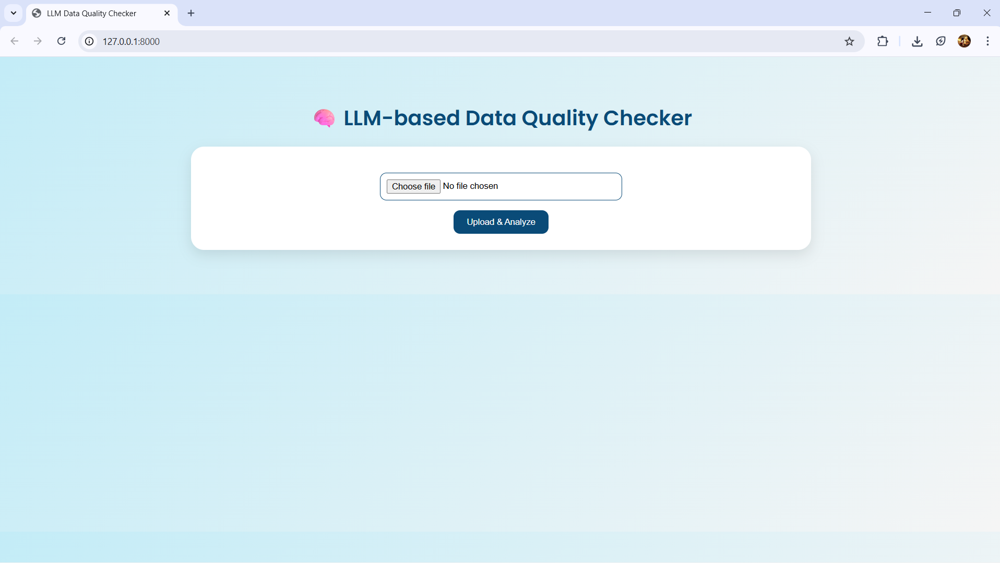
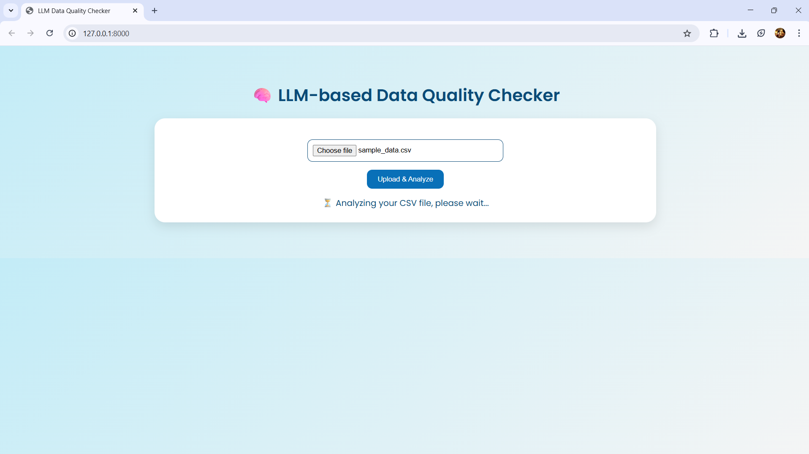
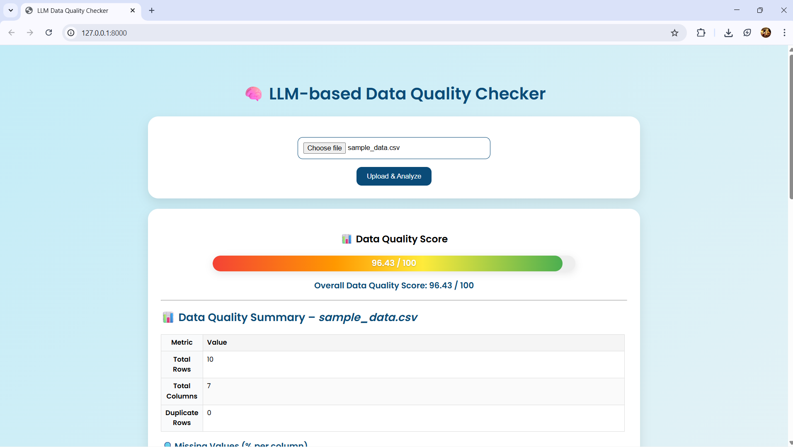
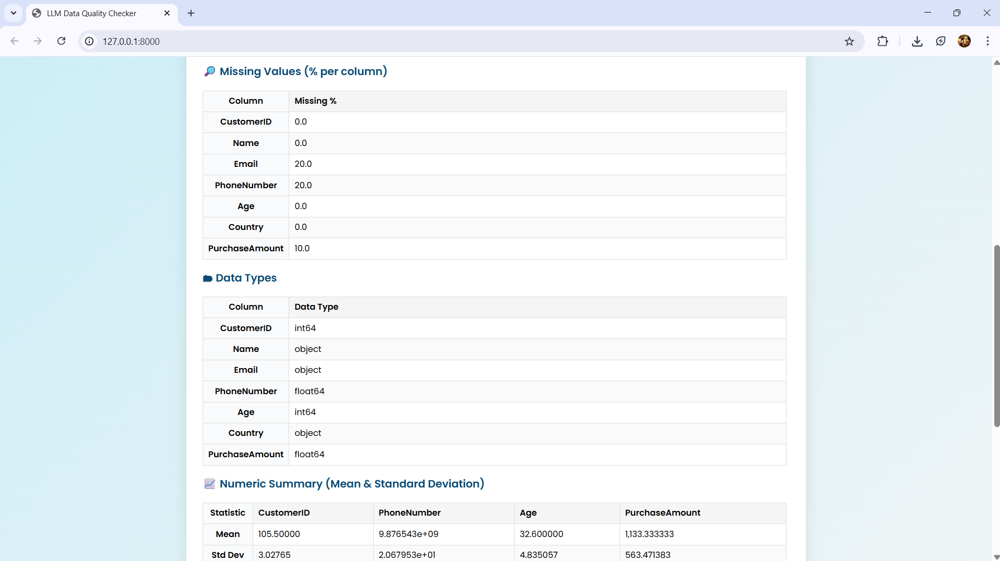
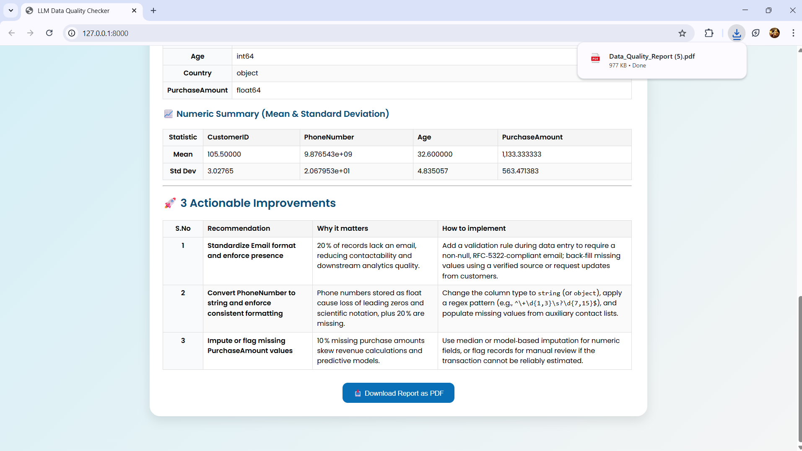
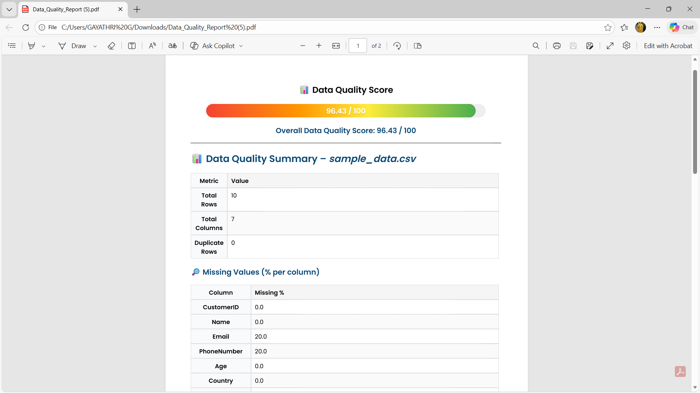
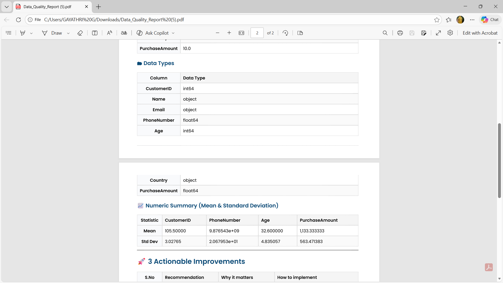
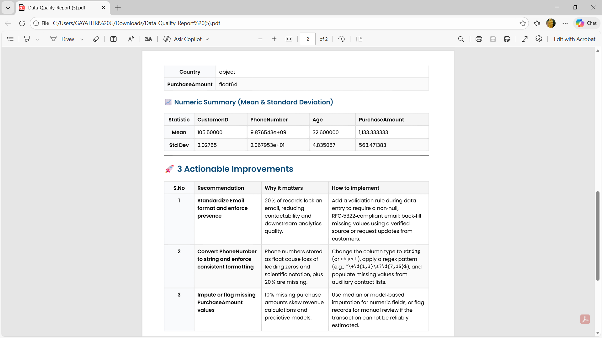

# 🧠 LLM-based Data Quality Checker

An **AI-powered web application** that analyzes CSV datasets and generates a **human-readable data quality report** using **Large Language Models (LLMs)**.  
It automatically detects **missing values**, **duplicates**, **data type mismatches**, and provides **smart improvement suggestions** with a **Data Quality Score**.

---

## 📸 Project Screenshots
  
 
 
 
 
 
 
 


---

## 🚀 Features

- 📂 Upload any CSV file
- 🤖 LLM generates a **natural-language report**
- 📊 Detects missing data, duplicates, and wrong data types
- 💡 Suggests **3 actionable improvements**
- 🌈 Displays **Data Quality Score (0–100)** with gradient colors
- 🧾 **Download full report as PDF** (multi-page, no cropping)
- 🧠 Built using **FastAPI + Pandas + OpenRouter LLM**

---

## 🏗️ Architecture

```text
User Uploads CSV
        ↓
FastAPI Backend (Python)
        ↓
Pandas → Analyze Data Stats
        ↓
LLM (OpenRouter / GPT / Mistral)
        ↓
Generates Readable Data Quality Report
        ↓
Frontend (HTML + JS) → Displays Report + PDF Export
